📱 Social Media App — React Project (Work in Progress)
This is a social media application built with React and modern front-end tools, currently under active development.

It features user posts, threaded comments, reply forms, media integration, and interactive UI components.

Note:
Some post screenshots intentionally display different UI states — for example:

Posts without like or comment counts to showcase the basic post layout.

Posts with like counts shown in a condensed format (e.g. 1.8k) to demonstrate number abbreviation behavior.

This was done to preview multiple display states during the current design phase. In future updates, these states will be unified for a consistent UI experience across all post types.

---

## 📸 Application Screenshots (As of July 2025)

Below are some current screenshots from the application to showcase the UI and features developed so far:

### 🏠 Signup page


### 📝 Signin Page

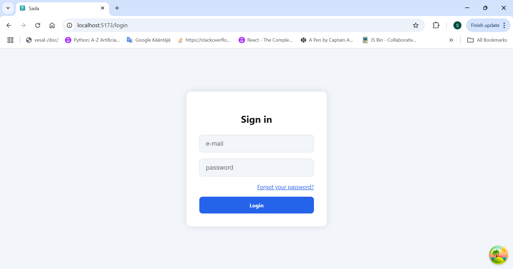

### ➕ Add New Post

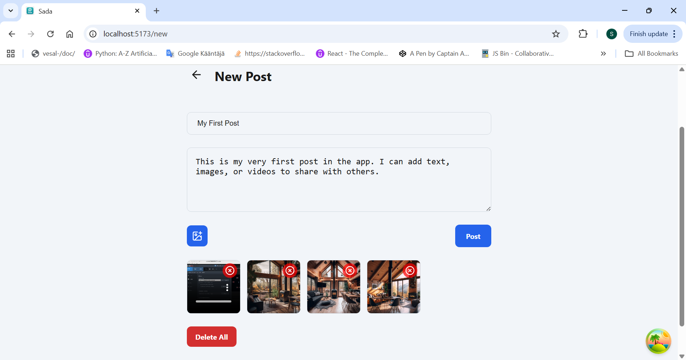

### Post containing one image

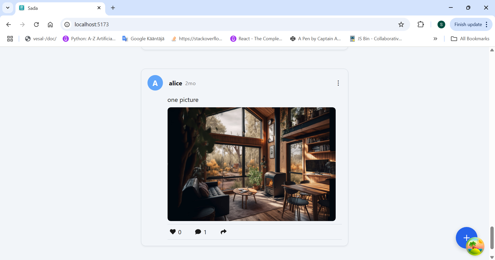

### Single-image post | Likes count shown in shortened format when over 1K (e.g., 1.8K)

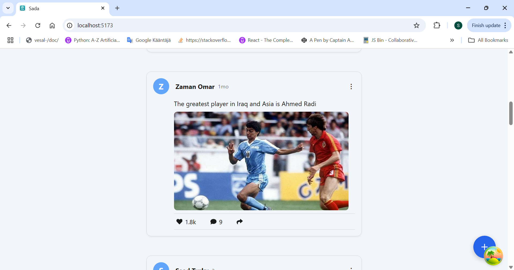

### Post containing two images

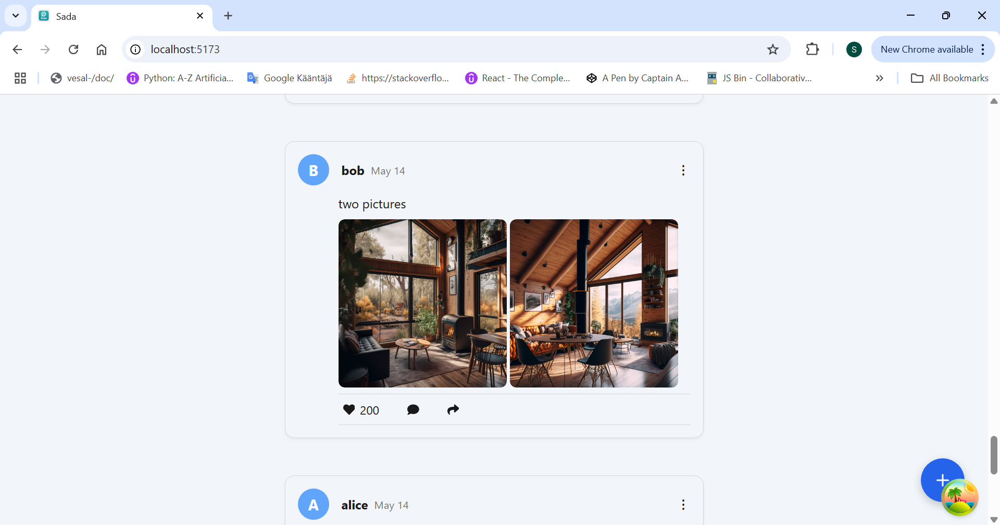

### Post containing three images


### Post containing four images

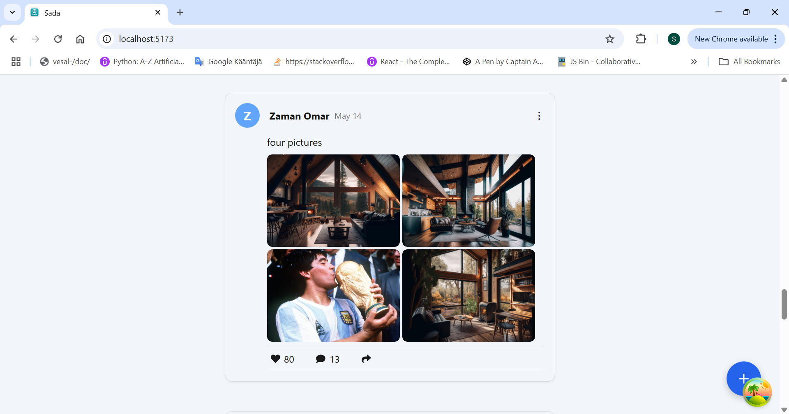

### This post contains one image and four videos, and displays a +1 label to indicate that the post includes more than four media files.

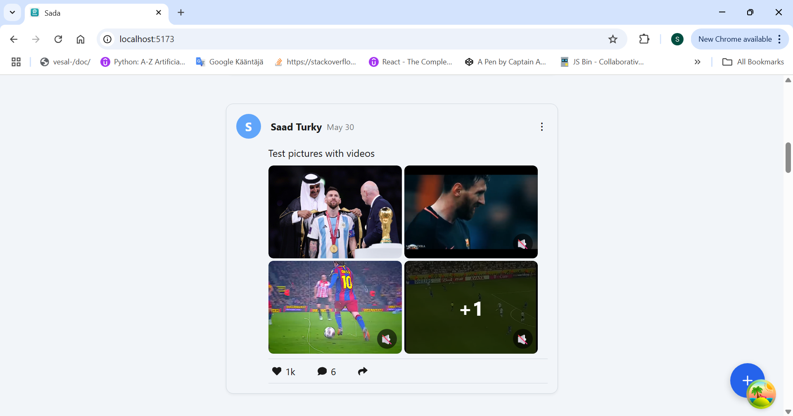

### Screenshot showing two posts:

The first post contains an English text with a Read More option and no media.  
The second post starts with Arabic text, includes four images, and displays a +2 badge to indicate two additional images beyond the visible four.

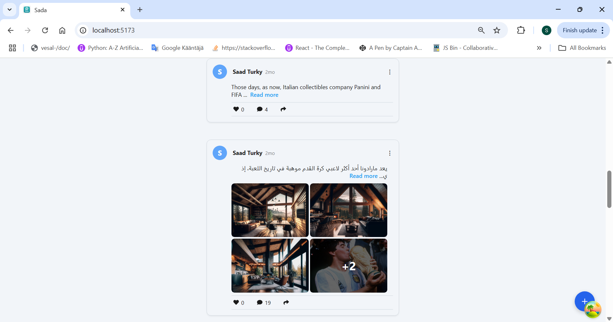

### Post containing one video

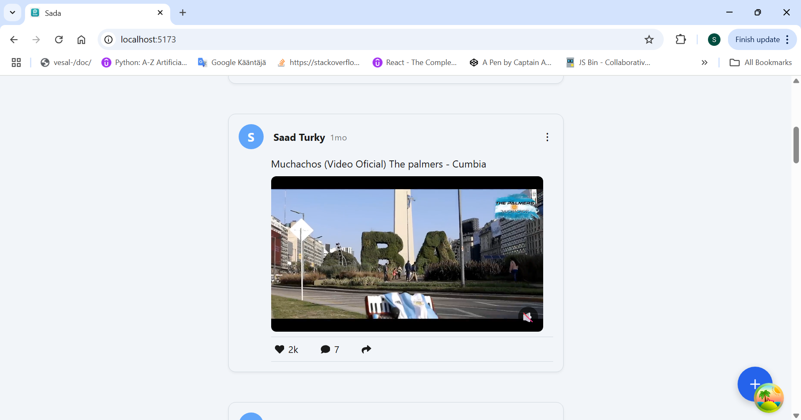

### Post Details Page screenshot:

This page appears after clicking on a post’s text. It displays:

- A Back button to return to the post feed.
- Full post details including user name, time of posting, and attached media (images or videos).
- Below the media section, it shows comment count and like count in a clean and distinct layout.
- A precise timestamp displaying the exact date and time of publication.
- Action buttons at the bottom to like the post or share it.

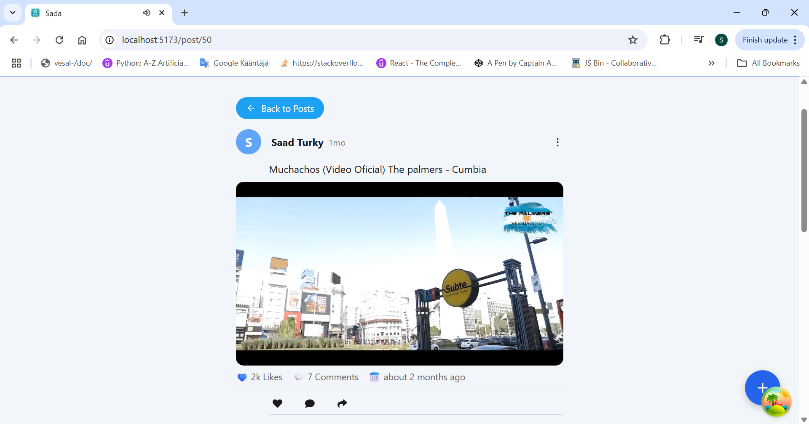

### Post Details — Comments Section screenshot:

This section appears within the Post Details page and displays:

- A comment input field with a placeholder text “Write a comment…” allowing users to add a new top-level comment.
- A list of existing top-level comments only (no replies shown directly here).
- Each comment includes:
  - A Like button.
  - A visible count of how many replies are attached to it.
- The comments are arranged vertically in chronological order beneath the input field.

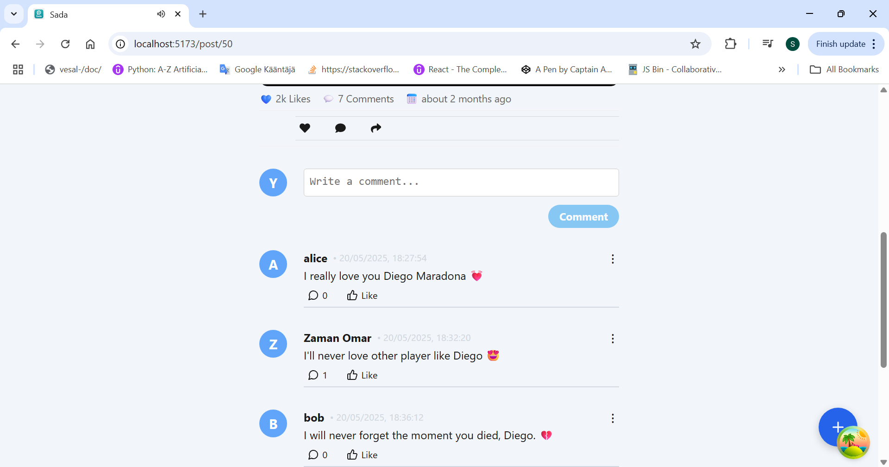

### Comment Thread Page screenshot:

This page appears after clicking on a specific comment within the Post Details page to view its direct replies. It includes:

- The main post displayed at the top.
- The selected parent comment shown directly below the post, connected visually by a continuous vertical gray line linking the post author's avatar and the commenter's avatar.
- Below the parent comment, a list of direct replies to this comment is displayed.
- Each direct reply includes:
  - The author's name.
  - A like button.
  - A count of replies attached to it.
  - A menu button represented by three vertical dots (⋮) that opens a side menu with actions like Delete.

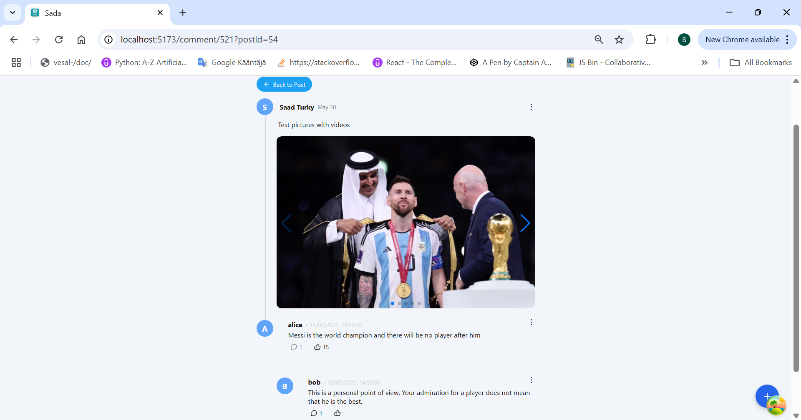

### Nested Replies Page screenshot (continuation of the Comment Thread):

This page displays nested replies inside a direct reply on the Comment Thread page:

- One of the direct replies has two nested replies.
- When clicking the comments icon on a direct reply, its nested replies appear indented beneath it to visually indicate a reply structure.
- Each nested reply displays:
  - The author’s name.
  - A like button.
  - If there are additional replies on it, a counter showing the number of replies.
- When clicking on any reply text, a reply form appears containing:
  - A text input placeholder.
  - A cancel button to close the form.
  - A send button shaped like a paper plane ✈️, which stays disabled until text is entered.

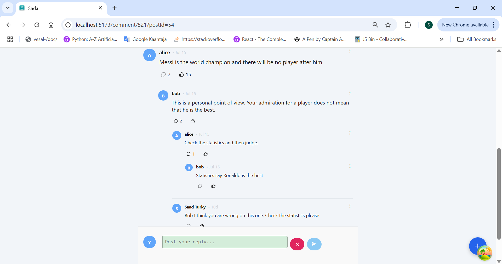

### 📸 Photo Modal — Screenshot 1 (Post Details & Comments Layout)

- Displays media (images/videos) on the left side with navigation arrows (left arrow hidden on the first media item).
- A close (X) button at the top-left to exit the media viewer and return to the main post list.
- On the right side:
  - Post text followed by action buttons (Comment, Like, Share) directly beneath the post content.
  - A three-dots menu button for post actions like (Delete Post).
- Main comments section where:
  - Each main comment displays:
    - A visual connector line starting from the commenter's avatar, moving downward and bending horizontally towards the 'View X Replies' button indicating the relationship between the main comment and its replies.
  - Below each comment:
    - Like button
    - Reply button
    - Three-dots menu for comment actions (Delete Comment)
  - No like or reply actions are inside the three-dots menu — they are visible as buttons directly below each comment.
- A fixed comment input field at the bottom of the comment section, containing:
  - A text input placeholder (Write a comment...)
  - A paper plane button for sending (disabled until text is entered)

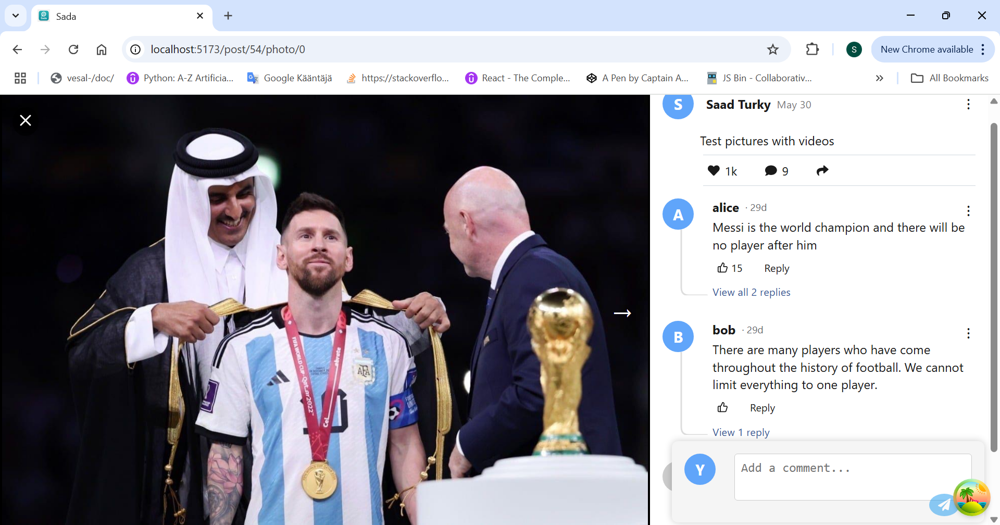

### 📸 Photo Modal — Screenshot 2 (Nested Replies View)

- After tapping ‘View X Replies’ under a main comment:
  - A tree-like visual structure appears:
    - Connector lines from the main commenter’s avatar to each direct reply
    - Nested lines for replies to those replies, forming a clear hierarchical tree for the conversation.
- Each reply still displays:
  - Like button
  - Reply button
  - Three-dots menu for actions like (Delete Comment)
- After tapping the Reply button on any comment:
  - A reply form appears with:
    - A placeholder text (Write a reply...)
    - A paper plane send button (disabled until text is entered)

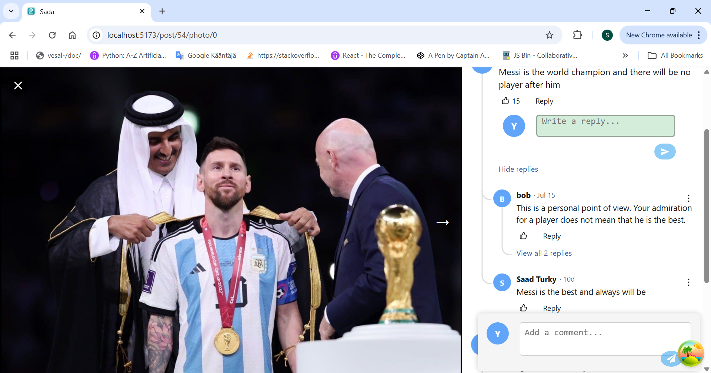

### 📸 Photo Modal — Screenshot 3 (Video & Comments Tree)

- The media area now displays a video player instead of an image.
- Progress bar and custom seek controls:
  - Tap on video edges to seek +10s / -10s
  - Buttons for precise +10s / -10s jump
- Full comment tree is displayed:
  - Visual lines connect main comments to their direct replies
  - Nested replies (replies to replies) are connected with additional branches
- The existing interaction buttons and menus remain consistent as in previous screens.

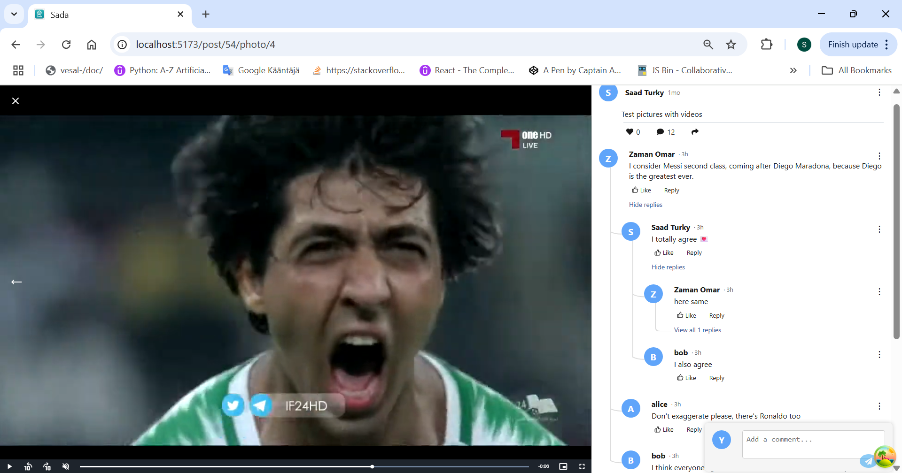

# Soft-Delete Comment Feature

The **Soft-Delete** feature allows comments to be removed from the user interface while keeping them in the database.

## Behavior

1. **Comments without replies**

   - The comment disappears from the UI.
   - Remains in the database for record-keeping or future review.

2. **Comments with replies**
   - A placeholder text `deleted comment` is shown.
   - Replies remain visible under the deleted comment.

## Database Persistence

- Deleted comments are never permanently removed.
- Allows for moderation review, dispute resolution, or restoration if needed.

- This approach is applied to all pages where comments appear.

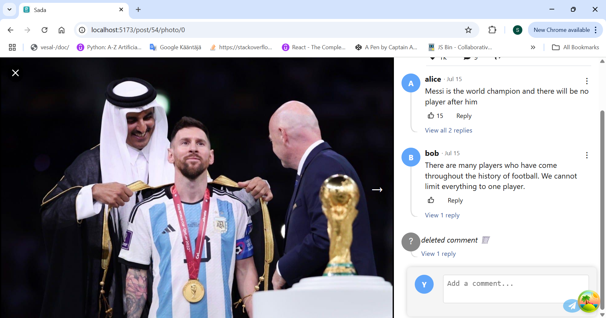

## Comments Pagination Approaches

### 1. Automatic Load on Scroll (Photo Modal Page)

In this approach, when the user scrolls to the end of the comments list and the “Loading more comments…” indicator becomes fully visible, the next batch of comments is automatically fetched and displayed.

- **Purpose:** Prevents loading all comments at once, avoiding lag or slow performance, especially with a large number of comments.
- **Benefit:** Creates a seamless experience where older comments appear automatically without user clicks.

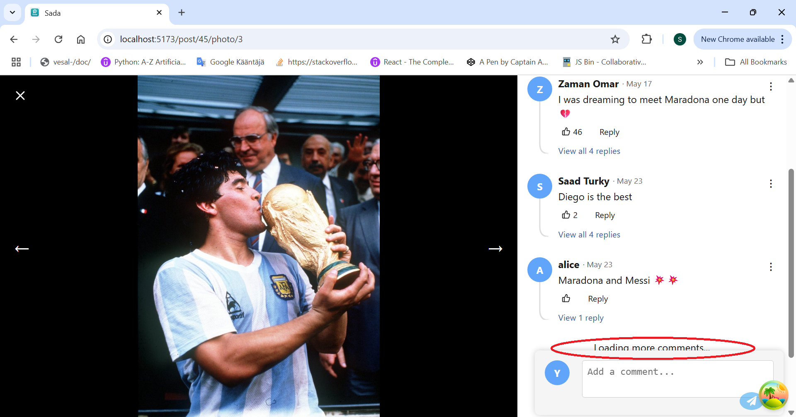

### 2. Manual Load More Button (Post Details Page)

This method uses the same loading logic and batching as the first approach, but instead of automatic loading, the user must click a “Load more comments” button to fetch the next set.

- **Purpose:** Demonstrates a manual interaction alternative while keeping the same underlying pagination process.
- **Benefit:** Gives users direct control over loading additional comments.

> Both methods share the same pagination logic and goals — the difference lies only in the interaction style.  
> For educational purposes, both styles were implemented to serve as a reference for future projects.

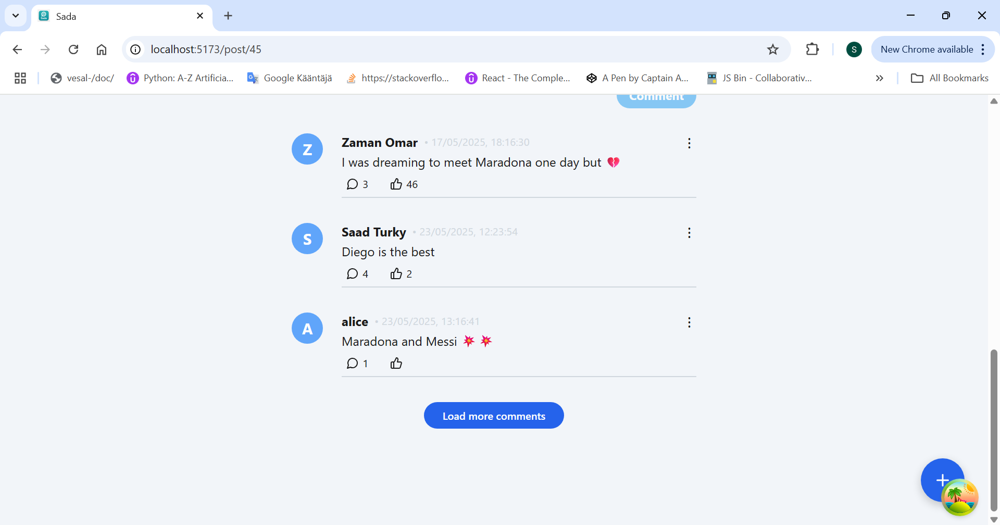

## 📦 Technologies & Packages Used

| Package                     | Version |
| :-------------------------- | :------ |
| **React**                   | 19.0.0  |
| **React DOM**               | 19.0.0  |
| **React Router DOM**        | 7.5.3   |
| **React Icons**             | 5.5.0   |
| **Lucide React**            | 0.507.0 |
| **Styled Components**       | 6.1.17  |
| **React Hook Form**         | 7.56.3  |
| **React Query (TanStack)**  | 5.75.2  |
| **React Query Devtools**    | 5.75.2  |
| **React Textarea Autosize** | 8.5.9   |
| **React Hot Toast**         | 2.5.2   |
| **Date FNS**                | 4.1.0   |
| **Swiper**                  | 11.2.10 |
| **Video.js**                | 8.22.0  |
| **Supabase JS**             | 2.49.4  |
| **date-fns**                | 4.1.0   |

---

## 📌 Notes

- 📌 This project is actively being developed and updated daily.
- 📌 The app is currently **not deployed live** — these screenshots demonstrate the latest working version.
- 📌 All features and UI are subject to improvements as the project progresses.

---

## 🚀 Installation & Run

```
bash
npm install
npm run dev

```

## Project Structure

app tree

```
sada-app/
├── src/
│   ├── assets/
│
│   ├── Auth/
│   │   ├── ForgotPassword.jsx
│   │   ├── LoginForm.jsx
│   │   ├── SignupForm.jsx
│   │   └── AuthWrapper.jsx
│
│   ├── Comment/
│   │   ├── CommentActions.jsx
│   │   ├── CommentHeader.jsx
│   │   ├── CommentItem.jsx
│   │   ├── CommentOptionsMenu.jsx
│   │   ├── CommentThread.jsx
│   │   ├── ReplyForm.jsx
│   │   ├── TreeLineSVG.jsx
│   │   ├── CommentItemParts/
│   │   │   ├── CommentContainer.jsx
│   │   │   ├── ReplyFormStyledWrapper.jsx
│   │   │   ├── ReplyViewButton.jsx
│   │   │   ├── RepliesContainer.jsx
│   │   │   └── useReplyTreeLayout.js
│   │   └── CommentThreadPages/
│   │       ├── BackButton.jsx
│   │       ├── CommentActions.jsx
│   │       ├── CommentContentText.jsx
│   │       ├── CommentHeader.jsx
│   │       ├── CommentThreadContext.jsx
│   │       ├── CommentThreadStyles.js
│   │       ├── DeletedComment.jsx
│   │       ├── RenderComment.jsx
│   │       ├── RepliesList.jsx
│   │       ├── ReplyFormStyled.jsx
│   │       ├── RplyModal.jsx
│   │       └── VerticalLineWrapper.jsx
│
│   ├── components/
│   │   ├── PhotoModalPages/
│   │   │   ├── PhotoModalCloseButton.jsx
│   │   │   ├── PhotoModalCommentsList.jsx
│   │   │   ├── PhotoModalImageSection.jsx
│   │   │   ├── PhotoModalInfoSection.jsx
│   │   │   ├── PhotoModalMediaViewer.jsx
│   │   │   ├── PhotoModalNavButtons.jsx
│   │   │   ├── PhotoModalOverlay.jsx
│   │   │   ├── PhotoModalPostActions.jsx
│   │   │   ├── PhotoModalPostContent.jsx
│   │   │   ├── PhotoModalPostHeader.jsx
│   │   │   └── PhotoModalReplyForm.jsx
│   │   │
│   │   ├── Post/
│   │   │   ├── PostActions.jsx
│   │   │   ├── PostContent.jsx
│   │   │   ├── PostContentPages/
│   │   │   │   ├── ContentWrapper.jsx
│   │   │   │   ├── MediaGrid.jsx
│   │   │   │   ├── MediaItem.jsx
│   │   │   │   ├── Overlay.jsx
│   │   │   │   ├── PostContentImage.jsx
│   │   │   │   ├── PostContentText.jsx
│   │   │   │   ├── PostContentVideo.jsx
│   │   │   │   ├── ReadMoreSpan.jsx
│   │   │   │   ├── SoundToggleButton.jsx
│   │   │   │   ├── StyledImage.jsx
│   │   │   │   └── StyledVideo.jsx
│   │   │   ├── PostHeader.jsx
│   │   │   ├── PostItem.jsx
│   │   │   ├── UserAvatar.jsx
│   │   │   └── VideoJsPlayer.jsx
│   │   │
│   │   ├── PostDetailsPages/
│   │   │   ├── PostDetailsActions.jsx
│   │   │   ├── PostDetailsCommentItem.jsx
│   │   │   ├── PostDetailsComments.jsx
│   │   │   ├── PostDetailsCommentsList.jsx
│   │   │   ├── PostDetailsContent.jsx
│   │   │   ├── PostDetailsHeader.jsx
│   │   │   ├── PostDetailsMedia.jsx
│   │   │   └── PostDetailsMeta.jsx
│   │   │
│   │   ├── newpostpages/
│   │   │   ├── MediaPreviewList.jsx
│   │   │   ├── NewPostForm.jsx
│   │   │   ├── styles.jsx
│   │   │   └── UploadButton.js
│
│   ├── hooks/
│   │   ├── useAuth.js
│   │   ├── useCachedPostLikes.js
│   │   ├── useCommentPagination.js
│   │   ├── useComments.js
│   │   ├── useGetLikesMap.js
│   │   ├── useLikes.js
│   │   ├── useMediaPreview.js
│   │   ├── usePost.js
│   │   ├── useRepliesMap.js
│   │   └── useToggleMenu.js
│
│   ├── layout/
│   │   ├── BottomNav.jsx
│   │   ├── Header.jsx
│   │   └── Layout.jsx
│
│   ├── pages/
│   │   ├── Home.jsx
│   │   ├── Login.jsx
│   │   ├── NewPost.jsx
│   │   ├── PhotoModal.jsx
│   │   ├── PostDetails.jsx
│   │   ├── Profile.jsx
│   │   ├── Signup.jsx
│   │   └── PostDetails.jsx
│
│   ├── routes/
│   │   └── AppRoutes.jsx
│
│   ├── services/
│   │   ├── api.js
│   │   ├── authService.js
│   │   ├── commentService.js
│   │   ├── likeService.js
│   │   ├── notificationService.js
│   │   ├── postService.js
│   │   ├── supabaseClient.js
│   │   └── userService.js
│
│   ├── Shared/
│   │   ├── Button.jsx
│   │   ├── FloatingAddButton.jsx
│   │   ├── Modal.jsx
│   │   ├── ReadMoreButton.jsx
│   │   └── Spinner.jsx
│
│   ├── styles/
│   │   ├── GlobalStyle.js
│   │   └── theme.js.js
│
│   ├── utils/
│   │   └── helpers.js
│
│   ├── App.jsx
│   └── main.jsx
│
└── .env

```

```

📬 Contact
For inquiries, feedback, or collaboration:

✉️ Email: saadstj@gmail.com

🐙 GitHub: https://github.com/saad78t/

📄 License
This project is open-source for review purposes and private use.
Commercial deployment is not permitted without explicit consent.

```

```

```
